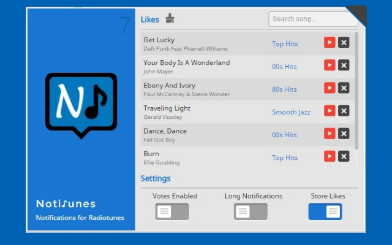
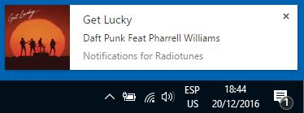
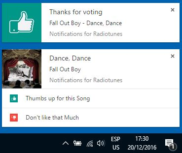

## What is Notitunes?

Notitunes is a Google Chrome extension that will allow you to have desktop notifications every time a song changes while you are listening [Radiotunes](http://radiotunes.com) in your browser.

<table>
 <tr>
  <td rowspan="2"></td>
  <td></td>
 </tr>
 <tr>
  <td></td>
 </tr> 
</table>

### Why I made Notitunes?

As a developer I spend a considerable amount of time coding or investigating over the internet and music always helps to keep me focused on what I'm going to do, so one of my prefered sources of music is _Radiotunes_ because the variety of stations and I do not have to install anything, just type the url and start to listen.

In this case one of the functionalities I miss from desktop players is the notification when a new song starts to play and if theres something _that breaks your concentration effectively_ is to leave your work enviroment to check for the info of a song you like, but with this extension you will always have that information opportunely in a desktop notification.

### Features

- Desktop Notifications
- Store songs info
- Direct link to search songs on youtube

### Where to Download?
<a href="https://chrome.google.com/webstore/detail/notifications-for-radiotu/niakkekcegpeeekiielpddigomfehdoa?hl=es-419" target="_blank">Notifications for Radiotunes on Chrome Store</a>
